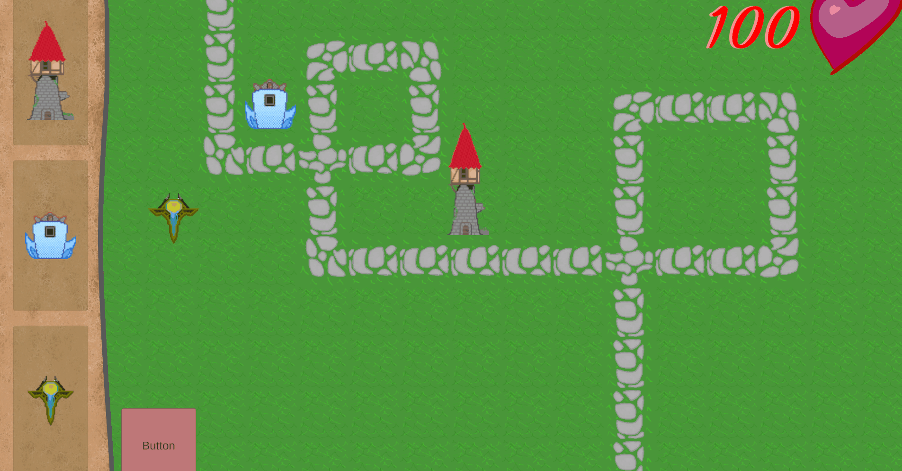
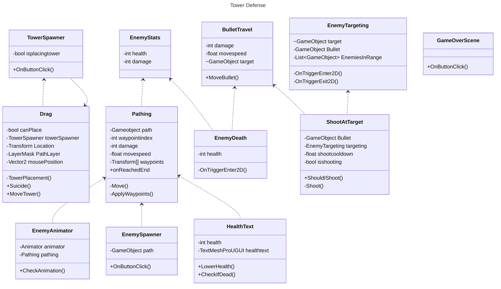
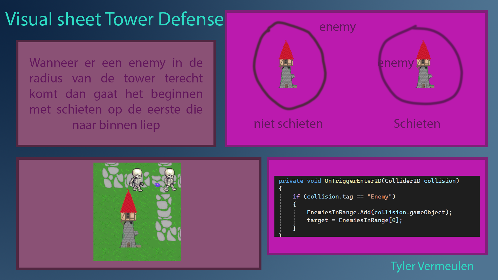

# TowerDefense

Dit is mijn BO voor periode 1 jaar 2 bij MediaCollege Amsterdam.
De opdracht hier was een tower defense maken die aan een paar requirements voldoen.

## Product 1: "DRY SRP Scripts op GitHub"

In [dit](/Tower%20Defense/Assets/Scripts/PathFinding/Pathing.cs) Script heb ik gebruik gemaakt van een list om een aantal locaties op te slaan.
wanneer de vijand inspawned dan gaat hij meteen bewegen naar nummer 1 op die list (niet nummer 0 want dat is de spawnlocatie) wanneer hij die bereikt dan gaat hij naar nummer 2 en zo door.
wanneer hij het einde bereikt dan stuurt hij een event naar een ander script voor het HP en vernietigd hij zichzelf

## Product 2: "Projectmappen op GitHub"

Dit is de [ROOT](/Tower%20Defense/) folder van mijn unity project.

## Product 3: Build op Github

[Here is the Build](https://github.com/TylerVermeulen/Tower-Defense/releases/tag/final)

## Product 4: Game met Sprites(animations) en Textures 

## Product 5: Issues met debug screenshots op GitHub 

[Hier is de link naar mijn issues](https://github.com/TylerVermeulen/Tower-Defense/issues)

## Product 6: Game design met onderbouwing 

[Hier de link naar mijn Design Doc](/PlayabilityAndReplayability/README.MD)

*  **Je game bevat torens die kunnen mikken en schieten op een bewegend doel.** 

*Mijn torens merken het op wanneer een enemy in de range is van de toren en wanneer hij daar iets detecteerd gaat hij van de eerste die in zijn range is gekomen richten en schieten. Wanneer de kogel beweegt richting het doelwit als het een andere enemy raakt dan gaat hij IPV het doelwit die enemy damage doen.*

*  **Je game bevat vernietigbare vijanden die 1 of meerderen paden kunnen volgen.**  

*Mijn Game bevat 1 type enemy: 
hij loopt richting het eindpunt met behulp van een waypoint systeem de manier dat het werkt is hij spawnt in op 1 gameobject(waarvan ze allemaal in een list zitten) een gaat lopen richting de volgende gameobject wanneer hij die bereikt gaat hij weer richting the volgende en zo gaat het door totdat hij het einde bereikt.*

*  **Je game bevat een “wave” systeem waarmee er onder bepaalde voorwaarden (tijd/vijanden op) nieuwe waves met vijanden het veld in komen.**

*Niet Gedaan*

*  **Een “health” systeem waarmee je levens kunt verliezen als vijanden hun doel bereiken en zodoende het spel kunt verliezen.** 

*Wanneer een enemy het eindpunt bereikt dan verwijdert hij zichzelf en triggert een event. Die event zorgt ervoor dat er een nummer(gebaseert op enemy) wordt afgenomen van een totaal HP nummer die je ook ziet in het hoekje van het scherm en wanneer die leeg is dan wordt je getransporteerd naar de verliesscene*

*  **Een “resource” systeem waarmee je resources kunt verdienen waarmee je torens kunt kopen en .evt upgraden.**

*Niet Gedaan*

*  **Een “upgrade” systeem om je torens te verbeteren.**

*Niet Gedaan*

*  **Een “movement prediction” systeem waarmee je kan berekenen waar een toren heen moeten schieten om een bewegend object te kunnen raken. (Moeilijk)**

*Niet Gedaan*

## Product 7: Class Diagram voor volledige codebase 

## Product 8: Prototype test video

Niet Gedaan

## Product 9: SCRUM planning inschatting 

[Link naar de openbare trello](https://trello.com/b/w60wkKSU/examen-paraphrenia)

## Product 10: Gitflow conventions

Niet Gedaan

