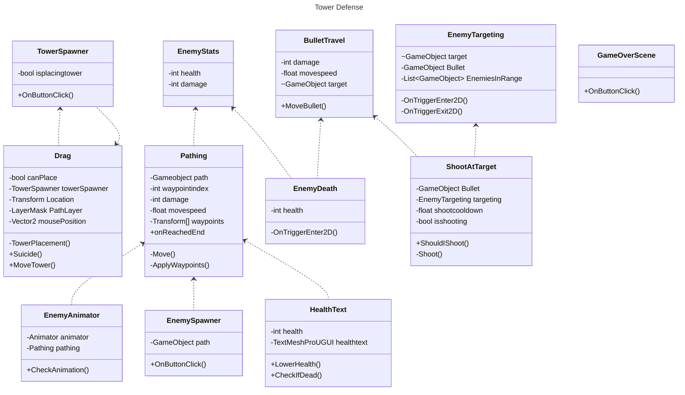

# TowerDefenseTemplate
Dit is een template wat door jullie te gebruiken is voor het juist inleveren van alle producten voor de Towerdefense beroepsopdracht. **Verwijder uiteindelijk de template teksten!**

Begin met een korte omschrijving van je towerdefense game en hoe deze werkt. Plaats ook een paar screenshots.

## Product 1: "DRY SRP Scripts op GitHub"

Plaats hier minimaal 1 link naar scripts die voldoen aan de eisen van **"Don't Repeat Yourself (DRY)"** en **"Single Responsibility Principle"**.
Omschrijf hier waarom jij denkt dat je in die scripts aan deze eisen voldoet.

Bijvoorbeeld:

*"In dit script heb ik een array gebruikt voor al mijn vijanden die in de nieuwe wave worden gespawnd. Hierdoor heb ik mijzelf niet hoeven herhalen **(DRY)** in de code omdat ik met 1 regel alle enemies kan plaatsen via en for each loop.
[link naar script](/MyTowerDefenseGame/Assets/Scripts/JustAScript.cs)"*

## Product 2: "Projectmappen op GitHub"

Je commit de mappenstructuur van je unity project op github en verwijst vanuit je readme naar de root map van je project. Met een netjes en goed gestructureerde mappenstructuur en benamingen van files toon je aan dat je dit leerdoel beheerst. 

Dit is de [ROOT](/MyTowerDefenseGame/) folder van mijn unity project.

Zorg dat deze verwijst naar je Develop branch.

## Product 3: Build op Github

Je maakt in Unity een stabiele “build” van je game waarbij bugs en logs eerst zijn verwijderd. Deze buildfiles upload je in je repository onder releases.  Bij eventuele afwijkingen moeten deze worden gedocumenteerd in de release. (Bijv controller nodig of spelen via netwerk etc..) 

[Release Voorbeeld](https://github.com/erwinhenraat/TowerDefenseTemplate/releases)

## Product 4: Game met Sprites(animations) en Textures 

## Product 5: Issues met debug screenshots op GitHub 

Zodra je bugs tegenkomt maak je een issue aan op github. In de issue omschrijf je het probleem en je gaat proberen via breakpoints te achterhalen wat het probleem is. Je maakt screenshot(s) van het debuggen op het moment dat je via de debugger console ziet wat er mis is. Deze screenshots met daarbij uitleg over het probleem en de bijhorende oplossing post je in het bijhorende github issue. 
[Hier de link naar mijn issues](https://github.com/TylerVermeulen/Tower-Defense/issues)

## Product 6: Game design met onderbouwing 

*  **Je game bevat torens die kunnen mikken en schieten op een bewegend doel.** 

*Mijn torens hebben ook nog een f.o.v waardoor je pas gaan mikken als enemies in de buurt zijn. ook hebben mijn torens geen 360 graden view maar 90 graden waardoor het een extra uitdaging is voor de speler om de torens ook op de meest tactische manier te roteren.*

*  **Je game bevat vernietigbare vijanden die 1 of meerderen paden kunnen volgen.**  

*Mijn enemies bevatten 3 types: 
1 snelle die ook snel dood gaat. echter als er veel snelle enemies zijn is de kans steeds groter dat ze bij hun doel komen omdat de torens maar 1 enemy tegelijk kan targetten. Het forceert de speler dus om veel goedkope torens te plaatsen.
Ook is er een langzame gepantserde enemy. Deze kan eigenlijk alleen maar worden vernietigd door magische torens die zijn geupgrade. goedkope torens doen bijna geen schade. De speler moet dus een balans gaan zoeken tussen veel goedkope torens en upgraden van torens.
Tot slot is er een vijand die andere enemies healt dit zorgt ervoor dat de speler een extra nadeel heeft en de torens handmatig de deze healer moet laten targetten hierdoor wordt de speler gedwongen om actiever de game te spelen omdat anders geen enkele enemy meer dood gaat.*

*  **Je game bevat een “wave” systeem waarmee er onder bepaalde voorwaarden (tijd/vijanden op) nieuwe waves met vijanden het veld in komen.**

*Heb ik niet kunnen doen*

*  **Een “health” systeem waarmee je levens kunt verliezen als vijanden hun doel bereiken en zodoende het spel kunt verliezen.** 

*Onderbouwing hier...*

*  **Een “resource” systeem waarmee je resources kunt verdienen waarmee je torens kunt kopen en .evt upgraden.**

*Heb ik niet kunnen doen*

*  **Een “upgrade” systeem om je torens te verbeteren.**

*Heb ik niet kunnen doen*

*  **Een “movement prediction” systeem waarmee je kan berekenen waar een toren heen moeten schieten om een bewegend object te kunnen raken. (Moeilijk)**

*Heb ik niet kunnen doen*

## Product 7: Class Diagram voor volledige codebase 

## Product 8: Prototype test video

Niet Gedaan

## Product 9: SCRUM planning inschatting 

[Hier de link naar mijn Trello](https://trello.com/invite/b/66d6c2bdbe01b04b343812b9/ATTI9410b8b30af66d2405ce8621f83578c7DEB059B9/torenaanvallen)

## Product 10: Gitflow conventions

Niet gedaan
