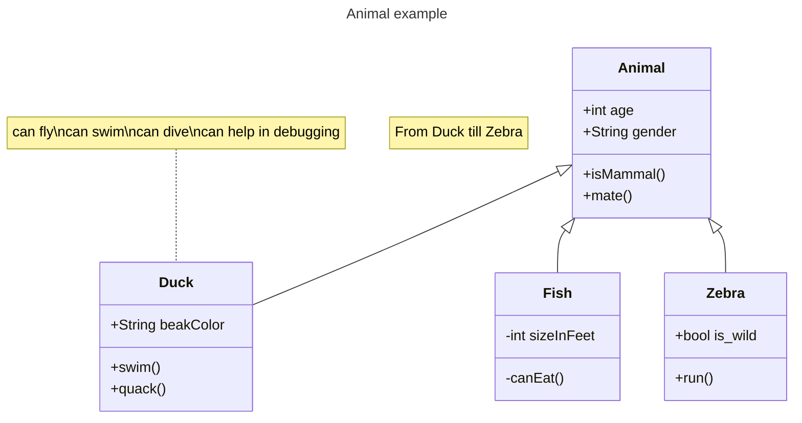

# TowerDefenseTemplate

 **Verwijder uiteindelijk de template teksten!**

Dit is mijn BO voor periode 1 jaar 2 bij MediaCollege Amsterdam.
De opdracht hier was een tower defense maken die aan een paar requirements voldoen.

## Product 1: "DRY SRP Scripts op GitHub"

In [dit](/Tower%20Defense/Assets/Scripts/PathFinding/Pathing.cs) Script heb ik gebruik gemaakt van een list om een aantal locaties op te slaan.
wanneer de vijand inspawned dan gaat hij meteen bewegen naar nummer 1 op die list (niet nummer 0 want dat is de spawnlocatie) wanneer hij die bereikt dan gaat hij naar nummer 2 en zo door.
wanneer hij het einde bereikt dan stuurt hij een event naar een ander script voor het HP en vernietigd hij zichzelf

## Product 2: "Projectmappen op GitHub"

Dit is de [ROOT](/Tower%20Defense/) folder van mijn unity project.

## Product 3: Build op Github

Je maakt in Unity een stabiele “build” van je game waarbij bugs en logs eerst zijn verwijderd. Deze buildfiles upload je in je repository onder releases.  Bij eventuele afwijkingen moeten deze worden gedocumenteerd in de release. (Bijv controller nodig of spelen via netwerk etc..) 

[Release Voorbeeld](https://github.com/erwinhenraat/TowerDefenseTemplate/releases)

## Product 4: Game met Sprites(animations) en Textures 

## Product 5: Issues met debug screenshots op GitHub 

[Hier is de link naar mijn issues](https://github.com/TylerVermeulen/Tower-Defense/issues)

## Product 6: Game design met onderbouwing 

Je gebruikt een game design tool om je game design vast te leggen en te communiceren. Daarnaast onderbouw je de design keuzes ten aanzien van “playability” en “replayability” voor je game schriftelijk. 

Voorbeeld van een one page design:

Omschrijf per mechanic welke game design keuzes je hebt gemaakt en waarom je dit hebt gedaan.

*  **Je game bevat torens die kunnen mikken en schieten op een bewegend doel.** 

*Mijn torens merken het op wanneer een enemy in de range is van de toren en wanneer hij daar iets detecteerd gaat hij van de eerste die in zijn range is gekomen richten en schieten. Wanneer de kogel beweegt richting het doelwit als het een andere enemy raakt dan gaat hij IPV het doelwit die enemy damage doen.*

*  **Je game bevat vernietigbare vijanden die 1 of meerderen paden kunnen volgen.**  

*Mijn Game bevat 1 type enemy: 
hij loopt richting het eindpunt met behulp van een waypoint systeem de manier dat het werkt is hij spawnt in op 1 gameobject(waarvan ze allemaal in een list zitten) een gaat lopen richting de volgende gameobject wanneer hij die bereikt gaat hij weer richting the volgende en zo gaat het door totdat hij het einde bereikt.*

*  **Je game bevat een “wave” systeem waarmee er onder bepaalde voorwaarden (tijd/vijanden op) nieuwe waves met vijanden het veld in komen.**

*Onderbouwing hier...*

*  **Een “health” systeem waarmee je levens kunt verliezen als vijanden hun doel bereiken en zodoende het spel kunt verliezen.** 

*Wanneer een enemy het eindpunt bereikt dan verwijdert hij zichzelf en triggert een event. Die event zorgt ervoor dat er een nummer(gebaseert op enemy) wordt afgenomen van een totaal HP nummer die je ook ziet in het hoekje van het scherm en wanneer die leeg is dan wordt je getransporteerd naar de verliesscene*

*  **Een “resource” systeem waarmee je resources kunt verdienen waarmee je torens kunt kopen en .evt upgraden.**

*Onderbouwing hier...*

*  **Een “upgrade” systeem om je torens te verbeteren.**

*Onderbouwing hier...*

*  **Een “movement prediction” systeem waarmee je kan berekenen waar een toren heen moeten schieten om een bewegend object te kunnen raken. (Moeilijk)**

*Onderbouwing hier...*

## Product 7: Class Diagram voor volledige codebase 

Je brengt je volledige codebase in kaart met behulp van een class diagram. Binnen de classes hoeven geen private members te worden weergegeven. Wel alle public members (fields en methods). Ook geef je indien relevant de relaties tussen je classes weer. Je class diagram plaats je in je readme op github. Evt mag je dit doen m.b.v de [“Mermaid”](https://mermaid.js.org/syntax/classDiagram.html) tool.

## Product 8: Prototype test video
Je hebt een werkend prototype gemaakt om een idee te testen. Omschrijf if je readme wat het idee van de mechanics is geweest wat je wilde testen en laat een korte video van de gameplay test zien. 

## Product 9: SCRUM planning inschatting 

Je maakt een SCRUM planning en geeft daarbij een inschatting aan elke userstory d.m.v storypoints / zelf te bepalen eenheden. (bijv. Storypoints, Sizes of tijd) aan het begin van een nieuwe sprint update je deze inschatting per userstory. 

Plaats in de readme een link naar je trello en **zorg ervoor dat je deze openbaar maakt**

[Link naar de openbare trello](https://trello.com/b/w60wkKSU/examen-paraphrenia)

## Product 10: Gitflow conventions

Je hebt voor je eigen project in je readme gitflow conventies opgesteld en je hier ook aantoonbaar aan gehouden. 

De gitflow conventions gaan uit van een extra branch Develop naast de "Master"/"Main". Op de main worden alleen stabiele releases gezet.

Verder worden features op een daarvoor bedoelde feature banch ontwikkeld. Ook kun je gebruik maken van een hotfix brancg vanaf develop.

Leg hier uit welke branches jij gaat gebruiken en wat voor namen je hier aan gaat meegeven. Hoe vaak ga je comitten en wat voor commit messages wil je geven?

Meer info over het gebruiken van gitflow [hier](https://www.atlassian.com/git/tutorials/comparing-workflows/gitflow-workflow)

